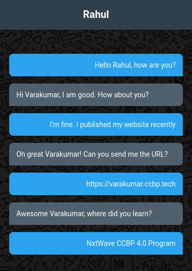

# 🛡️ Chat Page

## 💡 Skills Used
- HTML5
- CSS3
- Bootstrap

## 🔍 Preview

## 📸 How to Run Locally
1. Download or clone this repository
2. Open `Chat-Page` folder in VS Code
3. Run `index.html` in a browser

## 🙌 Author
Made with ❤️ by [Anusha](https://github.com/anushavalluri22);